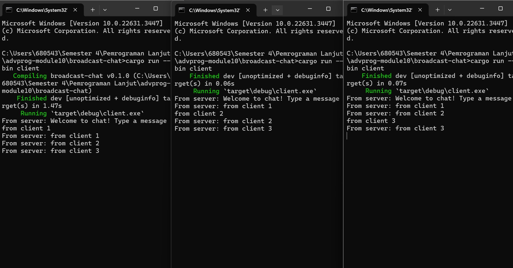
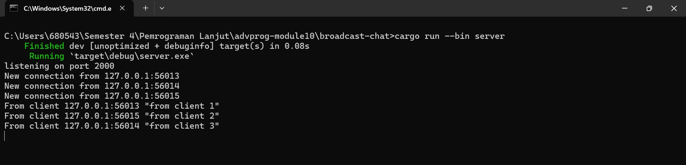
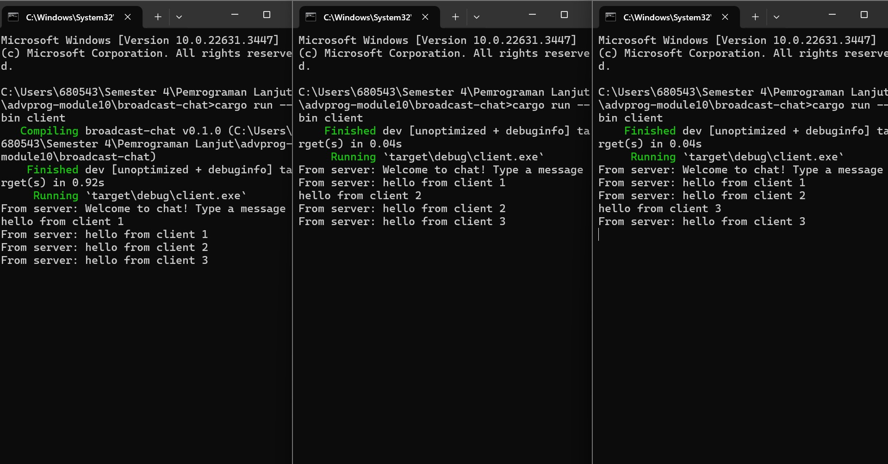
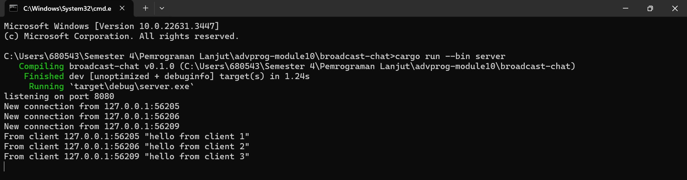
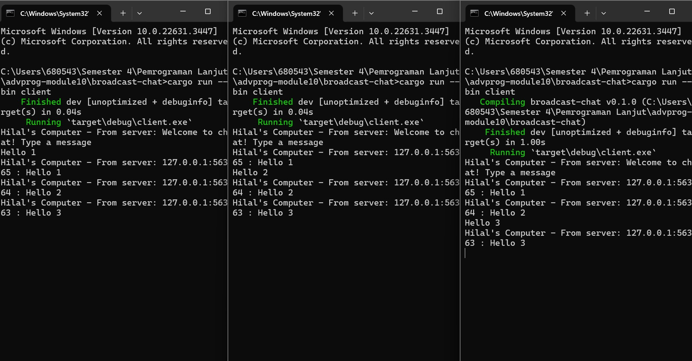
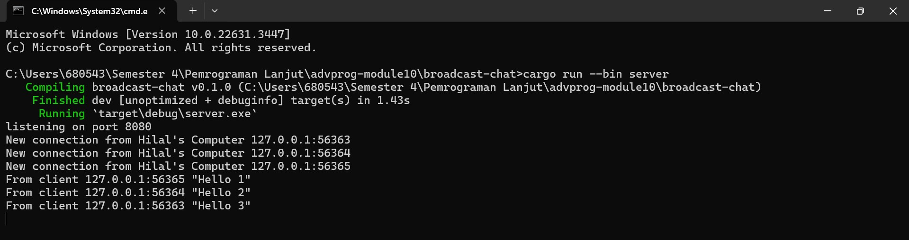

# **Rust Tutorial & Exercise**
**Muhammad Hilal Darul Fauzan**<br/>
**2206830542**<br/>
**Pemrograman Lanjut C**<br/>

## **Tutorial Modul 10: Asynchronous Programming**

### 2.1. Original code of broadcast chat.




Berdasarkan gambar di atas, terlihat bahwa ada tiga client yang masing-masing mengirimkan pesan. Gambar tersebut juga menunjukkan bahwa server menerima pesan dari tiap client dan kemudian mengirimkannya kembali ke semua client. Untuk menjalankan program tersebut, langkah pertama yang saya lakukan adalah membuka empat terminal. Lalu, jalankan perintah `cargo run --bin server` untuk mengatur server. Kemudian diikuti dengan menjalankan perintah `cargo run --bin client` di tiga terminal sisanya untuk mengaktifkan tiga client. Setelah itu, di terminal yang berfungsi sebagai client, pesan dapat diketik dan dikirimkan ke server. Selanjutnya, server akan mengirimkannya ke semua client yang terkoneksi dengannya.

### 2.2. Modifying the websocket port

Untuk mengubah port dari 2000 menjadi 8080, ubah potongan kode berikut pada `src/bin/server.rs` dan `src/bin/client.rs`.
```rust
// src/bin/server.rs

// before
let listener = TcpListener::bind("127.0.0.1:2000").await?;

println!("listening on port 2000");

// after
let listener = TcpListener::bind("127.0.0.1:8080").await?;

println!("listening on port 8080");
```

```rust
// src/bin/client.rs

// before
ClientBuilder::from_uri(Uri::from_static("ws://127.0.0.1:2000"))

// after
ClientBuilder::from_uri(Uri::from_static("ws://127.0.0.1:8080"))
```

Berdasarkan kode pada `src/bin/bin/server.rs` dan `src/bin/bin/client.rs`, kedua program tersebut menggunakan protokol WebSocket yang sama yang dikelola oleh library `tokio_websockets`. Hal ini memastikan bahwa komunikasi antara client dan server berjalan menggunakan protokol yang konsisten dan terdefinisi dengan baik.

Dari gambar di bawah ini, terlihat juga bahwa program masih beroperasi dengan baik meskipun terdapat perubahan pada port yang digunakan. Hal ini menunjukkan fleksibilitas dalam konfigurasi konektivitas antara client dan server. <br>



### 2.3. Small changes. Add some information to client

Berikut ini modifikasi kode yang saya lakukan:
```rust
// src/bin/server.rs
// before
if let Some(text) = msg.as_text() {
    println!("From client {addr:?} {text:?}");
    bcast_tx.send(text.into())?;
}

// after
if let Some(text) = msg.as_text() {
    println!("From client {addr:?} {text:?}");
    bcast_tx.send(format!("{addr} : {text}"))?;
}
```

```rust
// src/bin/server.rs
// before
println!("New connection from {addr:?}");

// after
println!("New connection from Hilal's Computer {addr:?}");
```

```rust
// src/bin/client.rs
// before
if let Some(text) = msg.as_text() {
    println!("From server: {}", text);
}

// after
if let Some(text) = msg.as_text() {
    println!("Hilal's Computer - From server: {}", text);
}
```

Beberapa modifikasi yang telah saya lakukan di atas berguna untuk menambahkan fitur broadcast addr yang berisi address dari mana pesan dikirim. Saya juga memasukkan informasi dari Hilal's Computer pada beberapa pesan yang dikirim.

Berikut hasil output setelah dilakukan modifikasi pada kode

